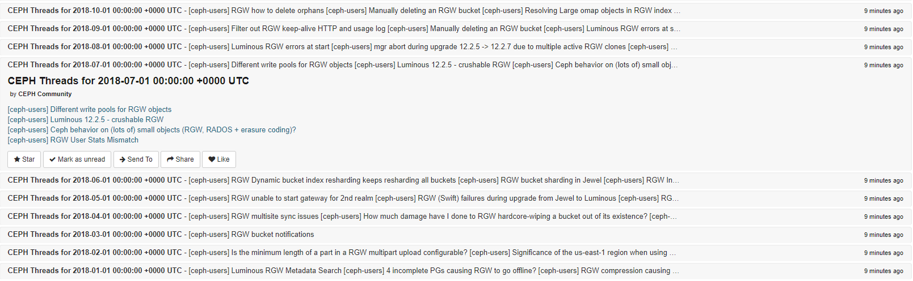

mailman-summarizer
==========

General Idea:
---------

 - http://lists.ceph.com/pipermail/ceph-users-ceph.com/
 - Find last month's thread archive like http://lists.ceph.com/pipermail/ceph-users-ceph.com/2018-November/thread.html
 - Find threads with one or more patterns in the subject
 - Return something like:
   - An RSS feed (could take an existing RSS feed as an input and add another element to it)
   - An e-mail
   - To stdout
   - JSON

Usage:
-------

installing go:

<pre>
 export GOPATH=$HOME/go
</pre>

dependencies:
<pre>

 go get -u github.com/PuerkitoBio/goquery
 go get -u github.com/gocolly/colly/...
 go get -u github.com/gorilla/feeds/...
</pre>

building:

<pre>
 go build
</pre>

running: 
<pre>

 ./mailman-summarizer -h
</pre>

Example Output if subscribing to the feed in https://theoldreader.com
----------------

Deployment
----------

This repo uses travis and a cronjob to run the script and deploy the XML to google cloud object store

 - needs a google cloud project, a service account, a key in json, a key encrypted with travis
 - then needs the gsutil in the travis build env

The URL to the produced feed is: https://storage.googleapis.com/ceph-rgw-users/feed.xml

Sources
=====

Started as a fork of colly-example.

 - https://benjamincongdon.me/blog/2018/03/01/Scraping-the-Web-in-Golang-with-Colly-and-Goquery/
 - https://github.com/bcongdon/colly-example

https://github.com/PuerkitoBio/goquery
https://github.com/gocolly/colly
